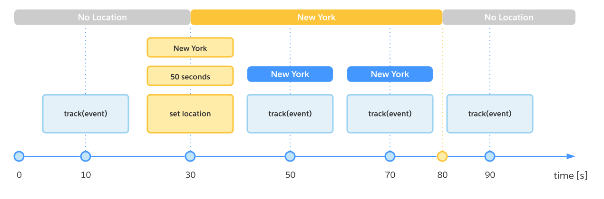

# Salesforce MarketingCloud CDP SDK - iOS

The Salesforce CDP SDK makes it possible for brands to integrate their mobile applications with [Salesforce Customer 360 Audiences](https://www.salesforce.com/products/marketing-cloud/customer-data-platform/) to capture rich behavioral and demographic data from end users, including app lifecycle and screen navigation events.

## Prerequisites
Integrating your mobile application with this SDK requires a Customer 360 Audience Mobile App Source ID and Tenant Specific Endpoint. See [C360 Audiences Integration Guide](https://help.salesforce.com/articleView?id=c360_a_web_mobile_app_connector.htm&type=5).

## Swift docs
See [docs](https://salesforce-marketingcloud.github.io/mobile-sdk-cdp-ios/docs/1.0.0/index.html) for complete SDK code definitions.

## Installation
You can add the CDP SDK to your mobile application using [CocoaPods](https://cocoapods.org/) (recommended) or by building manually from source.

### CocoaPods

To integrate the CDP SDK with your iOS mobile app using [CocoaPods](https://guides.cocoapods.org/using/using-cocoapods.html), create a Podfile and add the dependency:
```
use_frameworks!

target '<Your Target>' do
    pod 'MarketingCloud-Cdp', '~> 1.0'
end

```

## Quickstart Code Sample
```swift
// Enable Logging (Optional)
CdpSdk.setLogLevel(MCLogLevel.debug, logOutputter: LogOutputter())

// Create configuration
let config = CdpConfigBuilder(appId: "REPLACE WITH APP ID", endpoint: "REPLACE WITH ENDPOINT").build()

// Initialize SDK
_ = CdpSdk.configure(config)

// Request SDK Instance
let sdk = CdpSdk.shared

// Set SDK Consent state
sdk.consent = Consent.optIn

// Set SDK Location for 1 minute
sdk.setLocation(coordinates: Coordinates(latitude: 54.187738, longitude: 15.554440), expiresIn: 60)

// Create Engagement Event
let engagementEvent = Event.engagement(eventType: "AddToCart", attributes: ["sku": "ABC-123", "price": 19.99])

// Track the Engagement Event
sdk.track(event: engagementEvent)

// Create Profile Event
let profileEvent = Event.profile(eventType: "Identify", attributes: ["firstName": "John", "lastName": "Doe"])

// Track the Profile Event
sdk.track(event: profileEvent)

// Debugging - fetch state of the shared Cdp SDK instance.
_ = CdpSdk.shared.state

```
## Detailed Implementation

### <a name="configure"></a> Configure the SDK
To obtain an initialized instance of the SDK object, you must first provide a required configuration.

1. Build the CDP SDK configuration, providing the application id and Tenant Specific Endpoint (TSE).
  ```swift
  let config = CdpConfigBuilder(
    appId: {REPLACE WITH APP ID},
    endpoint: {REPLACE WITH ENDPOINT}
   )
  .trackScreens({True|False}) // optional, default false
  .trackLifecycle({True|False})  // optional, default false
  .sessionTimeout({Int}) // optional, default 600
  .build()
  ```
2. Call the configure method on the CDP SDK, passing the config.
    ```swift
    CdpSdk.configure(config)
    ```
Congratulations! The CDP SDK is now configured and ready to use.

| Config Option | Description |
| :---          | :--- |
| trackScreens | If enabled, "ScreenView" events will automatically be collected. |
| trackLifecycle | If enabled, lifecycle events (AppUpdate, AppFirstLaunch, AppLaunch) will automatically be collected. |
| sessionTimeout | Time (in seconds) an app can stay in the background before the session expires. Default is 600 seconds (10 minutes). |


### Granting Consent
The mobile application will obtain consent to track events from the end user and set the SDK's consent property accordingly, as shown below. Tracked events will be transmitted to the Salesforce CDP service only when the SDK consent property is set to optIn.

```swift
// Consent state is retained once set. It does not need to be called with every initialization.

// Sets SDK consent to optIn
CdpSdk.shared.consent = Consent.optIn

// Sets SDK consent to optOut
CdpSdk.shared.consent = Consent.optOut
```


| Consent State | Description |
| :---          | :--- |
| pending       | Default state <br> Tracked events will not be transmitted off device <br> Lifecycle and Screen Tracking Events will be queued locally <br> Engagement and Profile events will be discarded |
| optIn         | All events will be transmitted |
| optOut        | All events will be discarded |

<em>Once consent has been set to optIn or optOut, consent cannot be reset to pending.</em>

### Tracking Events
The CDP SDK enables collection of granular data about end users’ mobile app interactions through event tracking. An event consists of event type, and event attributes (optional). The CDP SDK currently supports two event categories, engagement and profile.

```swift
CdpSdk.shared.consent = Consent.optIn

// Create Engagement Event
let engagementEvent = Event.engagement(eventType: "AddToCart", attributes: ["sku": "ABC-123", "price": 19.99])

// Track the Engagement Event
CdpSdk.shared.track(event: engagementEvent)

// Create Profile Event
let profileEvent = Event.profile(eventType: "Identify", attributes: ["firstName": "John", "lastName": "Doe"])

// Track the Profile Event
CdpSdk.shared.track(event: profileEvent)

```
#### Note
* For best performance and battery-life, the CDP SDK queues events locally and transmits to Salesforce CDP in batches. The SDK will send events upon the app entering the foreground, moving to the background, or when the queue size hits 20.
* If an invalid eventType is used, the Event constructor will return null.
  * Reserved event types (case-insensitive): "AppFirstLaunch", "AppLaunch", "AppUpdate", "ScreenView"
  * Invalid event type: empty/blank String
* Invalid attributes will be dropped from the event, while retaining valid key/value pairs.
  * Reserved attribute keys (case-insensitive): "deviceId", "userId", "eventId", "sessionId", "dateTime", "eventType", "Category", "Latitude", "Longitude"
  * Allowed attribute value types: String, Bool, Int, Double, Float, NSNull

### Location Tracking
Location tracking is supported for all events. Enable this functionality by using the code shown below.

```swift

// Prepare the coordinates
let coordinates = Coordinates(latitude: 54.187738, longitude: 15.554440)

// Set the location coordinates to be valid for 60 seconds
CdpSdk.shared.setLocation(coordinates: coordinates, expiresIn: 60)

// Manually clear location before expiration
CdpSdk.shared.setLocation(coordinates: nil, expiresIn: 0)
```
When a location is provided to the SDK, all tracked events will have "latitude" and "longitude" attributes attached. When the location has expired, or is cleared, "latitude" and "longitude" will no longer be appended to new events. The chart below visualizes how locations are attached.



### Debugging

#### Logging
Logging is an optional, yet critical, SDK feature that allows the mobile application developer to select the verbosity of the CDP SDK’s output. By default, logging is disabled. Logging can be enabled as shown below.
```swift
// Logging should be set before the SDK is configured to ensure all logs are captured
CdpSdk.setLogLevel(MCLogLevel.debug, logOutputter: LogOutputter())
```

<em>The logOutputter parameter accepts a LogOutputter subclass. A custom class can be provided for more control over SDK logs.</em>

| Log Level Types | Description |
| :---          | :--- |
| debug | This log level provides granular, low-level information about how the SDK processes tasks, events and error details. Debug logging enables developers to perform diagnostics on their application to troubleshoot issues. |
| warning | This log level indicates the SDK integration might have a problem or it encountered an unusual situation. Warnings are associated with potentially harmful, but recoverable errors. |
| error | This log level provides details about unrecoverable errors usually associated with inability to complete valuable business use cases. |
| none | Default, no logs will be output |

#### SDK State
The state property on the CDP SDK shared instance returns a String containing current configuration settings, session details, event queue size, and consent information. This information is critical for debugging and troubleshooting purposes.

```swift
CdpSdk.shared.state
```

The SDK state will output similar to the block below.
```json
{
    "name":"cdp",
    "config": {
        "appId": "YOUR APP ID",
        "endpoint": "YOUR ENDPOINT",
        "sessionDuration": 600,
        "trackLifecycle": false,
        "trackScreens": false
    },
    "consentManager": {
        "deviceId": "YOUR DEVICE ID",
        "consent": "opt_in"
    },
    "sessionManager": {
        "sessionId": "SESSION ID"
    },
    "eventManager": {
        "queueSize": 2
    },
    "locationManager" : {
        "expiration" : 1610571507,
        "latitude" : 54.187738000000003,
        "longitude" : 15.55444
    }
}
```

### Troubleshooting

**I cannot set Consent to "PENDING".** <br>
A: Consent cannot be set to “pending”. Pending state of consent indicates that CDP SDK was initialized with its system default value and was not yet deliberately set. You can set consent to either "optIn or "optOut" value.

**My events got purged from the queue before sending.** <br>
A: Events are discarded from the queue only when consent is set to opt_out. You can verify consent status by inspecting the SDK state.

**My events are not being collected. My queue size doesn’t reflect tracked events.** <br>
A: Please make sure that the consent is set to opt_in. No events are collected when consent is set to opt_out, and only Lifecycle and Screen tracking events are collected when consent is pending.

### Support
When contacting support, please provide the SDK state and SDK logs in DEBUG mode.
